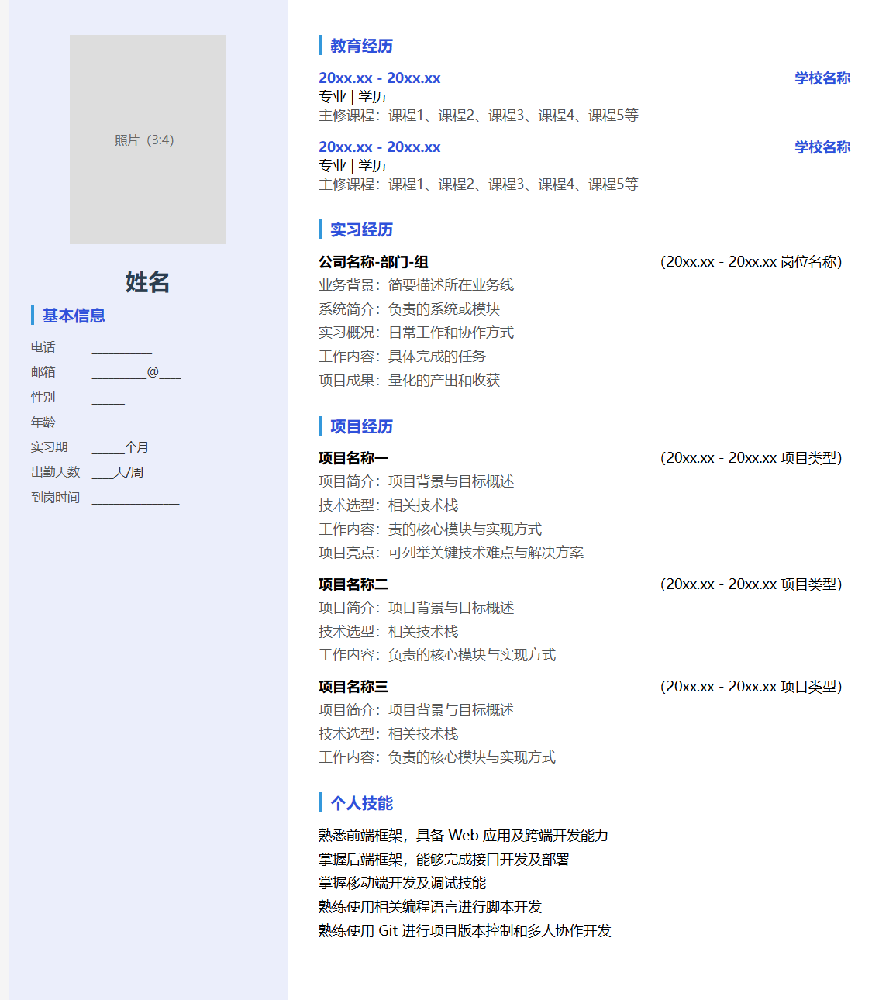
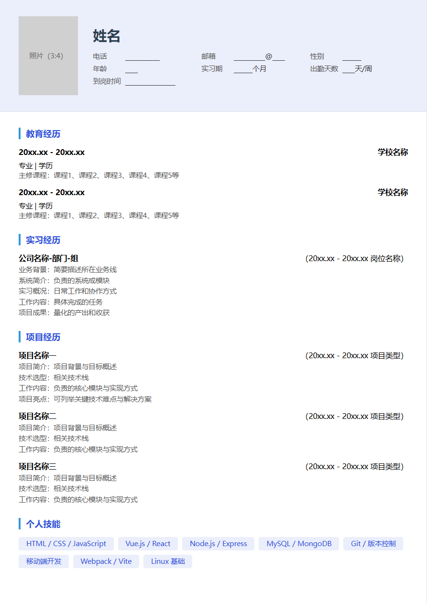

# 个人简历 HTML 模板

一个简洁、响应式的个人简历 HTML 模板，单个文件即可预览和打印，无需安装任何依赖。

## 预览

**左右结构**

**上下结构**

## 快速使用

1. 下载 `个人简历_左右结构模板.html` 或 `个人简历_上下结构模板.html`
2. 用浏览器打开，即可预览简历效果
3. 使用文本编辑器修改文件中的个人信息
4. 浏览器中 `Ctrl+P` 打印为 PDF

## 模板包含

两种布局可选：
- **左右结构**：左侧栏（照片、基本信息）+ 右侧内容（教育经历、实习经历、项目经历、个人技能）
- **上下结构**：顶部（头像、姓名、基本信息）+ 下方通栏内容（教育经历、实习经历、项目经历、个人技能）

## 样式特点

- 单文件零依赖，HTML + CSS 内联
- 提供左右分栏和上下通栏两种布局，打印友好
- 容器宽度 210mm × 297mm，精确匹配 A4 纸张比例
- 内置 `@page { size: A4 }` 打印样式，Ctrl+P 直接输出 A4 PDF

## 自定义

用任意文本编辑器打开 HTML 文件，搜索 `____` 或占位文字（如"姓名"、"学校名称"）进行替换即可。
